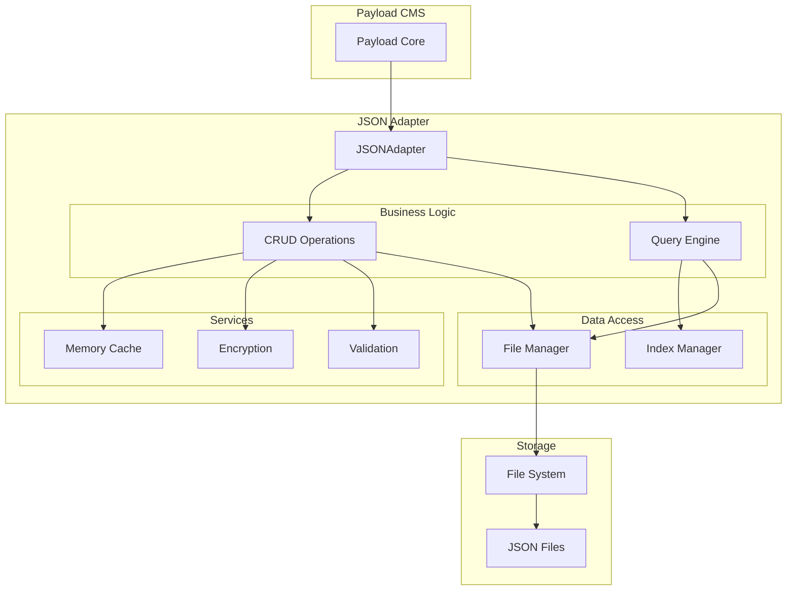
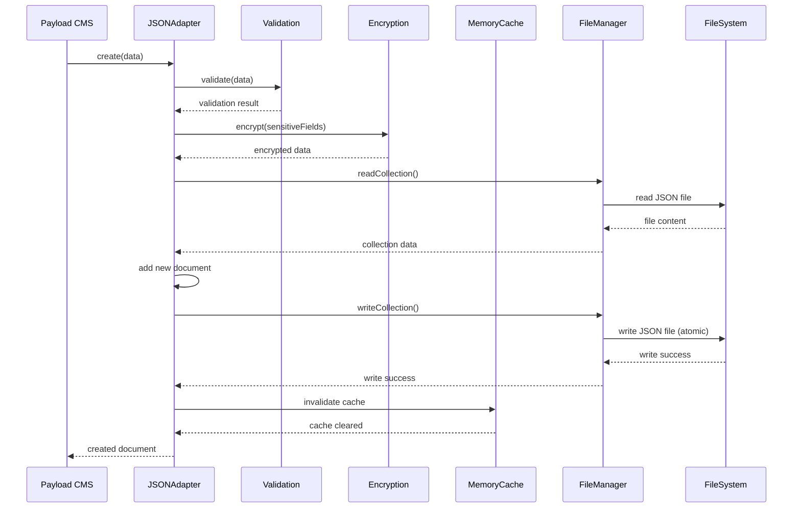
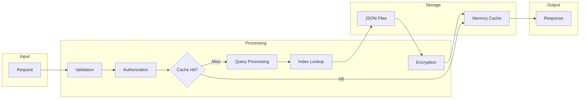
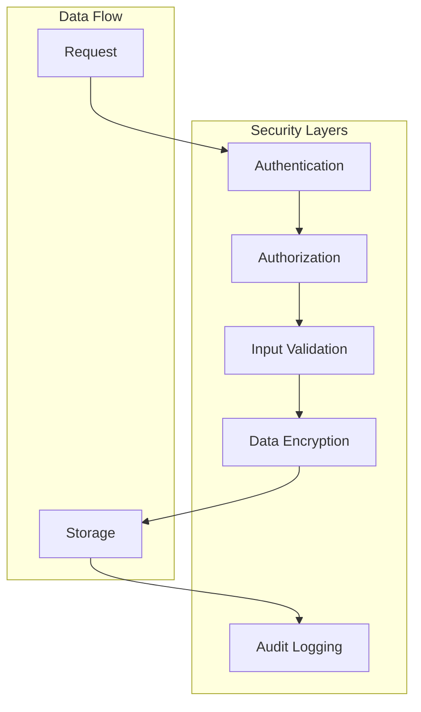

# Архитектура JSON Database Adapter

## Содержание

- [Обзор архитектуры](#обзор-архитектуры)
- [Основные компоненты](#основные-компоненты)
- [Диаграммы архитектуры](#диаграммы-архитектуры)
- [Паттерны проектирования](#паттерны-проектирования)
- [Производительность](#производительность)
- [Безопасность](#безопасность)
- [Масштабируемость](#масштабируемость)
- [Интеграция с Payload CMS](#интеграция-с-payload-cms)

## Обзор архитектуры

### Принципы проектирования

1. **Модульность** - каждый компонент имеет четко определенную ответственность
2. **Расширяемость** - легко добавлять новые функции без изменения существующего кода
3. **Производительность** - оптимизация для быстрого доступа к данным
4. **Безопасность** - шифрование данных и валидация входных параметров
5. **Простота использования** - минимальная конфигурация для начала работы

### Архитектурные слои

```
┌─────────────────────────────────────────┐
│              Payload CMS                │
├─────────────────────────────────────────┤
│           JSON Adapter API              │
├─────────────────────────────────────────┤
│     Business Logic Layer                │
│  ┌─────────────┬─────────────────────┐   │
│  │    CRUD     │    Query Engine     │   │
│  │  Operations │                     │   │
│  └─────────────┴─────────────────────┘   │
├─────────────────────────────────────────┤
│         Service Layer                   │
│  ┌─────────┬─────────┬─────────────┐     │
│  │ Caching │Encryption│ Validation  │     │
│  └─────────┴─────────┴─────────────┘     │
├─────────────────────────────────────────┤
│         Data Access Layer               │
│  ┌─────────────┬─────────────────────┐   │
│  │File Manager │    Index Manager    │   │
│  └─────────────┴─────────────────────┘   │
├─────────────────────────────────────────┤
│         Storage Layer                   │
│           JSON Files                    │
└─────────────────────────────────────────┘
```

## Основные компоненты

### 1. JSONAdapter (Основной адаптер)

**Назначение:** Главный интерфейс для взаимодействия с Payload CMS

**Ответственности:**
- Реализация интерфейса DatabaseAdapter
- Координация работы всех подсистем
- Управление жизненным циклом соединения

```typescript
interface DatabaseAdapter {
  create(args: CreateArgs): Promise<Document>
  find(args: FindArgs): Promise<FindResult>
  findByID(args: FindByIDArgs): Promise<Document>
  update(args: UpdateArgs): Promise<Document>
  delete(args: DeleteArgs): Promise<Document>
  count(args: CountArgs): Promise<{ totalDocs: number }>
}
```

**Архитектурные решения:**
- Использование паттерна Adapter для интеграции с Payload CMS
- Асинхронная обработка всех операций
- Централизованная обработка ошибок

### 2. FileManager (Менеджер файлов)

**Назначение:** Управление файловыми операциями

**Ответственности:**
- Чтение и запись JSON файлов
- Создание и управление структурой директорий
- Атомарные операции записи
- Обработка блокировок файлов

```typescript
class FileManager {
  private locks: Map<string, Promise<void>> = new Map()
  
  async readCollection(collection: string): Promise<any[]>
  async writeCollection(collection: string, data: any[]): Promise<void>
  async ensureDirectory(path: string): Promise<void>
  private async withLock<T>(key: string, operation: () => Promise<T>): Promise<T>
}
```

**Архитектурные решения:**
- Использование файловых блокировок для предотвращения race conditions
- Атомарная запись через временные файлы
- Lazy loading коллекций

### 3. MemoryCache (Система кэширования)

**Назначение:** Кэширование данных в памяти для повышения производительности

**Ответственности:**
- Кэширование часто используемых данных
- Управление TTL (время жизни кэша)
- Автоматическая инвалидация кэша
- Статистика использования кэша

```typescript
class MemoryCache {
  private cache: Map<string, CacheEntry> = new Map()
  private stats: CacheStats = { hits: 0, misses: 0, evictions: 0 }
  
  get<T>(key: string): T | null
  set<T>(key: string, value: T, ttl?: number): void
  delete(key: string): boolean
  clear(): void
  getStats(): CacheStats
}
```

**Архитектурные решения:**
- LRU (Least Recently Used) стратегия вытеснения
- Настраиваемое время жизни для разных типов данных
- Метрики для мониторинга эффективности

### 4. Encryption (Система шифрования)

**Назначение:** Шифрование чувствительных данных

**Ответственности:**
- Шифрование/дешифрование данных
- Управление ключами шифрования
- Поддержка различных алгоритмов шифрования

```typescript
class Encryption {
  private algorithm: string = 'aes-256-gcm'
  private key: Buffer
  
  encrypt(data: string): EncryptedData
  decrypt(encryptedData: EncryptedData): string
  generateKey(): string
  rotateKey(newKey: string): Promise<void>
}
```

**Архитектурные решения:**
- Использование AES-256-GCM для аутентифицированного шифрования
- Поддержка ротации ключей
- Селективное шифрование полей

### 5. QueryEngine (Движок запросов)

**Назначение:** Обработка сложных запросов к данным

**Ответственности:**
- Парсинг и выполнение запросов
- Фильтрация, сортировка, пагинация
- Оптимизация запросов
- Поддержка индексов

```typescript
class QueryEngine {
  async find(collection: any[], options: QueryOptions): Promise<FindResult>
  async count(collection: any[], where: WhereCondition): Promise<number>
  private applyFilters(data: any[], where: WhereCondition): any[]
  private applySorting(data: any[], sort: SortOptions): any[]
  private applyPagination(data: any[], limit?: number, page?: number): any[]
}
```

**Архитектурные решения:**
- Поддержка MongoDB-подобного синтаксиса запросов
- Оптимизация через индексы
- Ленивая загрузка результатов

### 6. IndexManager (Менеджер индексов)

**Назначение:** Управление индексами для ускорения запросов

**Ответственности:**
- Создание и поддержка индексов
- Автоматическое обновление индексов
- Оптимизация запросов с использованием индексов

```typescript
class IndexManager {
  private indexes: Map<string, Map<any, string[]>> = new Map()
  
  createIndex(collection: string, field: string): void
  updateIndex(collection: string, field: string, id: string, value: any): void
  findByIndex(collection: string, field: string, value: any): string[]
  rebuildIndexes(collection: string, data: any[]): void
}
```

**Архитектурные решения:**
- Hash-индексы для точного поиска
- Автоматическое создание индексов для часто используемых полей
- Инкрементальное обновление индексов

## Диаграммы архитектуры

### Диаграмма компонентов



### Диаграмма последовательности (Create Operation)



### Диаграмма потоков данных



## Паттерны проектирования

### 1. Adapter Pattern

**Применение:** Интеграция с Payload CMS

```typescript
// Payload CMS ожидает определенный интерфейс
interface DatabaseAdapter {
  create(args: CreateArgs): Promise<Document>
  // ... другие методы
}

// Наш адаптер реализует этот интерфейс
class JSONAdapter implements DatabaseAdapter {
  // Адаптирует наши внутренние методы к интерфейсу Payload
}
```

### 2. Strategy Pattern

**Применение:** Различные стратегии кэширования и шифрования

```typescript
interface CacheStrategy {
  get(key: string): any
  set(key: string, value: any): void
  evict(): void
}

class LRUCacheStrategy implements CacheStrategy {
  // Реализация LRU стратегии
}

class TTLCacheStrategy implements CacheStrategy {
  // Реализация TTL стратегии
}
```

### 3. Observer Pattern

**Применение:** Уведомления о изменениях данных

```typescript
interface DataChangeObserver {
  onDataChanged(collection: string, operation: string, data: any): void
}

class JSONAdapter {
  private observers: DataChangeObserver[] = []
  
  addObserver(observer: DataChangeObserver): void
  removeObserver(observer: DataChangeObserver): void
  private notifyObservers(collection: string, operation: string, data: any): void
}
```

### 4. Factory Pattern

**Применение:** Создание различных типов валидаторов

```typescript
class ValidatorFactory {
  static createValidator(type: string): Validator {
    switch (type) {
      case 'email': return new EmailValidator()
      case 'phone': return new PhoneValidator()
      case 'custom': return new CustomValidator()
      default: return new DefaultValidator()
    }
  }
}
```

### 5. Singleton Pattern

**Применение:** Глобальный кэш и менеджер конфигурации

```typescript
class ConfigManager {
  private static instance: ConfigManager
  private config: Config
  
  static getInstance(): ConfigManager {
    if (!ConfigManager.instance) {
      ConfigManager.instance = new ConfigManager()
    }
    return ConfigManager.instance
  }
}
```

## Производительность

### Оптимизации

1. **Кэширование на нескольких уровнях:**
   - Memory Cache для часто используемых данных
   - Query Result Cache для сложных запросов
   - Index Cache для ускорения поиска

2. **Ленивая загрузка:**
   - Коллекции загружаются только при первом обращении
   - Индексы строятся по требованию
   - Связанные данные загружаются при необходимости

3. **Пакетные операции:**
   - Группировка множественных операций записи
   - Batch-обновление индексов
   - Массовая инвалидация кэша

4. **Оптимизация файловых операций:**
   - Использование потоков для больших файлов
   - Атомарная запись через временные файлы
   - Сжатие данных при необходимости

### Метрики производительности

```typescript
interface PerformanceMetrics {
  queryTime: number
  cacheHitRate: number
  fileOperationTime: number
  memoryUsage: number
  indexEfficiency: number
}

class PerformanceMonitor {
  private metrics: PerformanceMetrics
  
  startTimer(operation: string): Timer
  recordMetric(name: string, value: number): void
  getMetrics(): PerformanceMetrics
  generateReport(): PerformanceReport
}
```

## Безопасность

### Уровни защиты

1. **Шифрование данных:**
   - AES-256-GCM для данных в покое
   - Селективное шифрование чувствительных полей
   - Безопасное управление ключами

2. **Валидация входных данных:**
   - Схемы валидации для всех операций
   - Санитизация пользовательского ввода
   - Проверка типов данных

3. **Контроль доступа:**
   - Интеграция с системой авторизации Payload
   - Проверка прав доступа на уровне коллекций
   - Аудит операций

4. **Защита файловой системы:**
   - Ограничение прав доступа к файлам данных
   - Проверка путей файлов (path traversal protection)
   - Резервное копирование с шифрованием

### Архитектура безопасности



## Масштабируемость

### Горизонтальное масштабирование

1. **Шардинг данных:**
   - Разделение коллекций по разным файлам
   - Распределение нагрузки между инстансами
   - Консистентное хеширование для распределения

2. **Репликация:**
   - Master-Slave репликация для чтения
   - Синхронизация изменений между репликами
   - Автоматическое переключение при сбоях

3. **Кэширование:**
   - Распределенный кэш (Redis/Memcached)
   - CDN для статических ресурсов
   - Edge caching для географически распределенных пользователей

### Вертикальное масштабирование

1. **Оптимизация памяти:**
   - Настраиваемые размеры кэша
   - Garbage collection оптимизация
   - Memory pooling для часто создаваемых объектов

2. **Оптимизация CPU:**
   - Асинхронная обработка операций
   - Worker threads для тяжелых вычислений
   - Оптимизация алгоритмов поиска и сортировки

3. **Оптимизация I/O:**
   - Пакетные операции записи
   - Использование SSD для хранения данных
   - Оптимизация размеров буферов

## Интеграция с Payload CMS

### Архитектура интеграции

```typescript
// payload.config.ts
import { buildConfig } from 'payload/config'
import { JSONAdapter } from 'payload-db-json'

export default buildConfig({
  db: JSONAdapter({
    dataDir: './data',
    caching: {
      enabled: true,
      ttl: 300000
    },
    encryption: {
      enabled: true,
      key: process.env.ENCRYPTION_KEY
    }
  }),
  collections: [
    // Ваши коллекции
  ]
})
```

### Жизненный цикл запроса

1. **Инициализация:**
   - Payload CMS создает экземпляр адаптера
   - Адаптер инициализирует все подсистемы
   - Проверяется доступность файловой системы

2. **Обработка запроса:**
   - Payload передает запрос адаптеру
   - Адаптер валидирует и обрабатывает запрос
   - Результат возвращается в Payload

3. **Завершение:**
   - Очистка временных ресурсов
   - Сохранение метрик производительности
   - Логирование операций

### Расширения и хуки

```typescript
// Хуки для расширения функциональности
interface AdapterHooks {
  beforeCreate?: (data: any) => Promise<any>
  afterCreate?: (result: any) => Promise<void>
  beforeUpdate?: (data: any) => Promise<any>
  afterUpdate?: (result: any) => Promise<void>
  beforeDelete?: (id: string) => Promise<void>
  afterDelete?: (id: string) => Promise<void>
}

class JSONAdapter {
  constructor(config: AdapterConfig & { hooks?: AdapterHooks }) {
    this.hooks = config.hooks || {}
  }
  
  async create(args: CreateArgs): Promise<Document> {
    if (this.hooks.beforeCreate) {
      args.data = await this.hooks.beforeCreate(args.data)
    }
    
    const result = await this.performCreate(args)
    
    if (this.hooks.afterCreate) {
      await this.hooks.afterCreate(result)
    }
    
    return result
  }
}
```

Эта архитектура обеспечивает гибкость, производительность и безопасность при работе с JSON-файлами в качестве базы данных для Payload CMS.