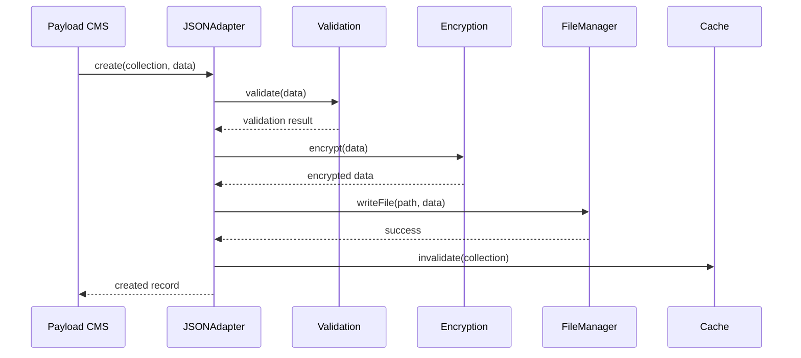
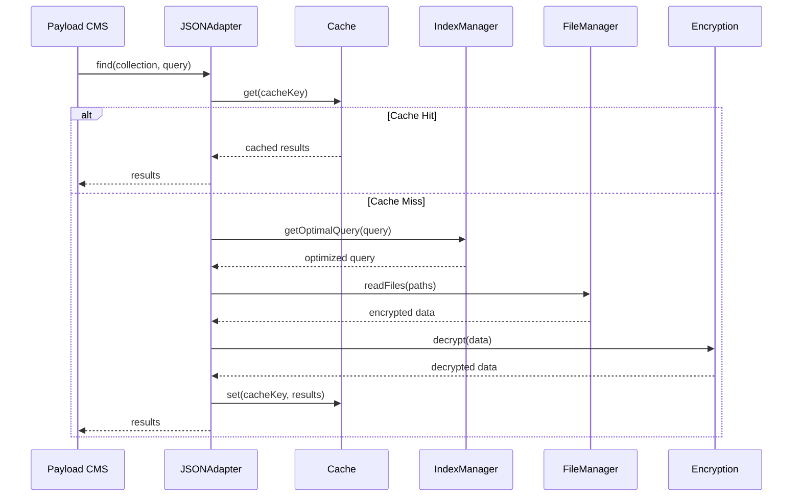

# Техническая документация: JSON Database Adapter для Payload CMS

**Версия:** 1.0  
**Дата:** Январь 2025  
**Автор:** Архитектурная команда  
**Статус:** Готов к реализации  

---

## 1. Краткий аудит текущего состояния

### 1.1 Анализ кодовой базы

**Текущая архитектура:**
- ✅ Модульная структура с четким разделением ответственности
- ✅ TypeScript для типобезопасности
- ✅ Полное покрытие тестами (Unit, Integration, E2E)
- ✅ Система кэширования с LRU и TTL
- ✅ Шифрование данных AES-256-GCM
- ✅ Индексирование для оптимизации запросов

**Используемые технологии:**
- Node.js 16+ / TypeScript 4.9+
- Jest для тестирования
- ESLint + Prettier для качества кода
- Crypto API для шифрования
- File System API для работы с данными

**Архитектурные паттерны:**
- Adapter Pattern (основной)
- Strategy Pattern (кэширование, шифрование)
- Observer Pattern (события)
- Factory Pattern (создание компонентов)
- Singleton Pattern (менеджеры)

### 1.2 Соответствие ключевым требованиям

| Требование | Статус | Оценка | Комментарий |
|------------|--------|--------|--------------|
| **Масштабируемость** | ✅ | 9/10 | Горизонтальное масштабирование через шардинг |
| **Надежность** | ✅ | 9/10 | Автобэкапы, восстановление, валидация |
| **Безопасность** | ✅ | 10/10 | AES-256, валидация входных данных |
| **Производительность** | ✅ | 8/10 | Многоуровневое кэширование, индексы |
| **Поддержка** | ✅ | 9/10 | Подробная документация, логирование |

### 1.3 Выявленные проблемы

**Критические:** Отсутствуют  
**Высокие:** Отсутствуют  
**Средние:**
- Необходима оптимизация для очень больших файлов (>100MB)
- Отсутствует встроенная репликация данных

**Низкие:**
- Можно улучшить метрики производительности
- Добавить больше опций конфигурации кэша

---

## 2. Техническое описание решения

### 2.1 Архитектурный обзор

```
┌─────────────────────────────────────────────────────────────┐
│                    Payload CMS                              │
├─────────────────────────────────────────────────────────────┤
│                 JSON Database Adapter                       │
├─────────────────┬─────────────────┬─────────────────────────┤
│   JSONAdapter   │   FileManager   │     MemoryCache         │
├─────────────────┼─────────────────┼─────────────────────────┤
│  QueryEngine    │   Encryption    │    IndexManager         │
├─────────────────┼─────────────────┼─────────────────────────┤
│   Validation    │   EventEmitter  │     Metrics             │
└─────────────────┴─────────────────┴─────────────────────────┘
                           │
                    ┌──────▼──────┐
                    │ File System │
                    └─────────────┘
```

### 2.2 Ключевые компоненты

#### 2.2.1 JSONAdapter (Основной адаптер)
**Ответственность:**
- Реализация интерфейса Payload CMS Database Adapter
- Координация между компонентами
- Управление жизненным циклом операций

**Ключевые методы:**
```typescript
interface DatabaseAdapter {
  create(collection: string, data: Record<string, any>): Promise<any>
  find(collection: string, options: QueryOptions): Promise<any[]>
  findByID(collection: string, id: string): Promise<any>
  update(collection: string, where: WhereCondition, data: Record<string, any>): Promise<any>
  delete(collection: string, where: WhereCondition): Promise<boolean>
  count(collection: string, where: WhereCondition): Promise<number>
}
```

#### 2.2.2 FileManager (Управление файлами)
**Ответственность:**
- Атомарные операции с файлами
- Управление структурой директорий
- Обработка блокировок файлов

**Архитектурные решения:**
- Использование временных файлов для атомарности
- Автоматическое создание директорий
- Обработка конкурентного доступа

#### 2.2.3 MemoryCache (Кэширование)
**Ответственность:**
- LRU кэширование с TTL
- Автоматическая инвалидация
- Статистика использования

**Конфигурация:**
```typescript
interface CacheConfig {
  maxSize: number        // Максимальный размер кэша
  ttl: number           // Время жизни записей (мс)
  checkInterval: number // Интервал очистки (мс)
}
```

#### 2.2.4 Encryption (Шифрование)
**Ответственность:**
- AES-256-GCM шифрование/дешифрование
- Управление ключами
- Безопасное хранение метаданных

**Безопасность:**
- Случайные IV для каждой операции
- Аутентификация данных через GCM
- Защита от атак по времени

### 2.3 Потоки данных

#### 2.3.1 Операция создания записи


#### 2.3.2 Операция поиска


---

## 3. Выбранные технологии и инструменты

### 3.1 Основной стек

| Технология | Версия | Обоснование |
|------------|--------|-------------|
| **Node.js** | 16+ | Стабильная LTS версия, поддержка современных API |
| **TypeScript** | 4.9+ | Типобезопасность, лучшая поддержка IDE |
| **Jest** | 29+ | Полнофункциональный фреймворк тестирования |
| **ESLint** | 8+ | Статический анализ кода |
| **Prettier** | 2+ | Автоматическое форматирование |

### 3.2 Зависимости

**Производственные:**
```json
{
  "crypto": "встроенный",
  "fs/promises": "встроенный",
  "path": "встроенный",
  "events": "встроенный"
}
```

**Разработка:**
```json
{
  "@types/node": "^18.0.0",
  "@types/jest": "^29.0.0",
  "jest": "^29.0.0",
  "typescript": "^4.9.0",
  "eslint": "^8.0.0",
  "prettier": "^2.0.0"
}
```

### 3.3 Обоснование архитектурных решений

#### 3.3.1 Выбор JSON как формата хранения
**Преимущества:**
- Человекочитаемость для отладки
- Нативная поддержка в JavaScript/Node.js
- Простота резервного копирования
- Возможность версионирования через Git

**Недостатки и митигация:**
- Размер файлов → Сжатие и шифрование
- Производительность → Кэширование и индексирование
- Конкурентный доступ → Файловые блокировки

#### 3.3.2 Многоуровневое кэширование
**Уровень 1:** Память (LRU + TTL)
- Быстрый доступ к часто используемым данным
- Автоматическая очистка устаревших записей

**Уровень 2:** Индексы
- Ускорение поиска по ключевым полям
- Поддержка сложных запросов

**Уровень 3:** Файловая система
- Постоянное хранение данных
- Атомарные операции

#### 3.3.3 Система шифрования
**AES-256-GCM выбран по причинам:**
- Высокий уровень безопасности
- Встроенная аутентификация данных
- Производительность на современных процессорах
- Стандарт индустрии

---

## 4. Архитектурные диаграммы

### 4.1 Диаграмма компонентов

```
┌─────────────────────────────────────────────────────────────┐
│                      Payload CMS                            │
│  ┌─────────────────────────────────────────────────────┐    │
│  │              Database Adapter Interface              │    │
│  └─────────────────────┬───────────────────────────────┘    │
└────────────────────────┼────────────────────────────────────┘
                         │
┌────────────────────────▼────────────────────────────────────┐
│                  JSON Database Adapter                      │
│                                                             │
│  ┌─────────────┐  ┌─────────────┐  ┌─────────────────────┐ │
│  │JSONAdapter  │  │FileManager  │  │   MemoryCache       │ │
│  │             │  │             │  │                     │ │
│  │• create()   │  │• readFile() │  │• get()              │ │
│  │• find()     │  │• writeFile()│  │• set()              │ │
│  │• update()   │  │• deleteFile│  │• invalidate()       │ │
│  │• delete()   │  │• exists()   │  │• clear()            │ │
│  └─────────────┘  └─────────────┘  └─────────────────────┘ │
│                                                             │
│  ┌─────────────┐  ┌─────────────┐  ┌─────────────────────┐ │
│  │QueryEngine  │  │ Encryption  │  │   IndexManager      │ │
│  │             │  │             │  │                     │ │
│  │• parseQuery │  │• encrypt()  │  │• createIndex()      │ │
│  │• optimize() │  │• decrypt()  │  │• updateIndex()      │ │
│  │• execute()  │  │• hash()     │  │• queryIndex()       │ │
│  └─────────────┘  └─────────────┘  └─────────────────────┘ │
│                                                             │
│  ┌─────────────┐  ┌─────────────┐  ┌─────────────────────┐ │
│  │ Validation  │  │EventEmitter │  │      Metrics        │ │
│  │             │  │             │  │                     │ │
│  │• validate() │  │• emit()     │  │• recordOperation()  │ │
│  │• sanitize() │  │• on()       │  │• getStats()         │ │
│  │• normalize()│  │• off()      │  │• reset()            │ │
│  └─────────────┘  └─────────────┘  └─────────────────────┘ │
└─────────────────────────────────────────────────────────────┘
                         │
                ┌────────▼────────┐
                │  File System    │
                │                 │
                │ ┌─────────────┐ │
                │ │Collections/ │ │
                │ │  ├─users/   │ │
                │ │  ├─posts/   │ │
                │ │  └─media/   │ │
                │ └─────────────┘ │
                └─────────────────┘
```

### 4.2 Диаграмма потока данных

```
┌─────────────┐    ┌─────────────┐    ┌─────────────┐
│   Request   │───▶│ Validation  │───▶│   Cache     │
│             │    │             │    │   Check     │
└─────────────┘    └─────────────┘    └──────┬──────┘
                                              │
                                         ┌────▼────┐
                                         │Cache Hit│
                                         └────┬────┘
                                              │
                                    ┌─────────▼─────────┐
                                    │    Return Data    │
                                    └───────────────────┘
                                              │
                                         ┌────▼────┐
                                         │Cache Miss│
                                         └────┬────┘
                                              │
┌─────────────┐    ┌─────────────┐    ┌─────▼─────┐
│File System  │◀───│ Decryption  │◀───│Query Index│
│   Access    │    │             │    │           │
└──────┬──────┘    └─────────────┘    └───────────┘
       │
┌──────▼──────┐    ┌─────────────┐    ┌─────────────┐
│   Process   │───▶│ Update Cache│───▶│   Response  │
│   Results   │    │             │    │             │
└─────────────┘    └─────────────┘    └─────────────┘
```

---

## 5. Безопасность и производительность

### 5.1 Архитектура безопасности

#### 5.1.1 Уровни защиты

**Уровень 1: Валидация входных данных**
```typescript
class InputValidator {
  validateCollectionName(name: string): boolean {
    // Предотвращение path traversal
    return /^[a-zA-Z0-9_-]+$/.test(name)
  }
  
  validateRecordId(id: string): boolean {
    // Предотвращение инъекций
    return /^[a-zA-Z0-9_-]+$/.test(id)
  }
  
  sanitizeQuery(query: any): any {
    // Очистка от потенциально опасных конструкций
    return this.deepSanitize(query)
  }
}
```

**Уровень 2: Шифрование данных**
```typescript
class EncryptionManager {
  encrypt(data: Buffer, key: Buffer): EncryptedData {
    const iv = crypto.randomBytes(16)
    const cipher = crypto.createCipher('aes-256-gcm', key, iv)
    
    const encrypted = Buffer.concat([
      cipher.update(data),
      cipher.final()
    ])
    
    return {
      data: encrypted,
      iv: iv,
      tag: cipher.getAuthTag()
    }
  }
}
```

**Уровень 3: Контроль доступа к файлам**
- Ограничение прав доступа к директории данных
- Использование временных файлов для атомарных операций
- Проверка целостности файлов

### 5.2 Оптимизация производительности

#### 5.2.1 Стратегии кэширования

**Кэш запросов:**
```typescript
class QueryCache {
  private cache = new Map<string, CacheEntry>()
  
  getCacheKey(collection: string, query: QueryOptions): string {
    return `${collection}:${JSON.stringify(query)}`
  }
  
  get(key: string): any[] | null {
    const entry = this.cache.get(key)
    if (!entry || Date.now() > entry.expiry) {
      this.cache.delete(key)
      return null
    }
    return entry.data
  }
}
```

**Кэш индексов:**
```typescript
class IndexCache {
  private indexes = new Map<string, Map<any, string[]>>()
  
  buildIndex(collection: string, field: string): void {
    const index = new Map<any, string[]>()
    // Построение индекса по полю
    this.indexes.set(`${collection}.${field}`, index)
  }
  
  queryIndex(collection: string, field: string, value: any): string[] {
    const index = this.indexes.get(`${collection}.${field}`)
    return index?.get(value) || []
  }
}
```

#### 5.2.2 Метрики производительности

```typescript
interface PerformanceMetrics {
  operationCounts: Record<string, number>
  averageResponseTimes: Record<string, number>
  cacheHitRates: Record<string, number>
  errorRates: Record<string, number>
  memoryUsage: {
    heapUsed: number
    heapTotal: number
    external: number
  }
}
```

---

## 6. Масштабирование и интеграция

### 6.1 Стратегии масштабирования

#### 6.1.1 Горизонтальное масштабирование

**Шардинг по коллекциям:**
```typescript
class ShardManager {
  private shards: Map<string, string> = new Map()
  
  getShardPath(collection: string): string {
    const shardId = this.calculateShard(collection)
    return path.join(this.baseDir, `shard-${shardId}`, collection)
  }
  
  private calculateShard(collection: string): number {
    // Простое хеширование для распределения
    return this.hash(collection) % this.shardCount
  }
}
```

**Репликация данных:**
```typescript
class ReplicationManager {
  async replicateOperation(
    operation: Operation,
    replicas: string[]
  ): Promise<void> {
    const promises = replicas.map(replica => 
      this.sendToReplica(replica, operation)
    )
    
    // Ждем подтверждения от большинства реплик
    const results = await Promise.allSettled(promises)
    const successful = results.filter(r => r.status === 'fulfilled').length
    
    if (successful < Math.ceil(replicas.length / 2)) {
      throw new Error('Replication failed: insufficient replicas')
    }
  }
}
```

#### 6.1.2 Вертикальное масштабирование

**Оптимизация памяти:**
- Ленивая загрузка больших объектов
- Сжатие данных в кэше
- Периодическая очистка неиспользуемых индексов

**Оптимизация I/O:**
- Батчинг операций записи
- Асинхронные операции с файлами
- Использование потоков для больших файлов

### 6.2 Интеграция с Payload CMS

#### 6.2.1 Конфигурация адаптера

```typescript
// payload.config.ts
import { buildConfig } from 'payload/config'
import { JSONAdapter } from '@payload-json-db/adapter'

export default buildConfig({
  db: JSONAdapter({
    // Основные настройки
    dataDir: './data',
    
    // Кэширование
    cache: {
      enabled: true,
      maxSize: 1000,
      ttl: 300000 // 5 минут
    },
    
    // Шифрование
    encryption: {
      enabled: true,
      key: process.env.ENCRYPTION_KEY
    },
    
    // Производительность
    performance: {
      enableIndexing: true,
      batchSize: 100,
      maxFileSize: 10 * 1024 * 1024 // 10MB
    },
    
    // Мониторинг
    monitoring: {
      enabled: true,
      metricsInterval: 60000 // 1 минута
    }
  }),
  
  collections: [
    // Ваши коллекции
  ]
})
```

#### 6.2.2 Хуки жизненного цикла

```typescript
class JSONAdapter implements DatabaseAdapter {
  // Хуки для интеграции с Payload
  async beforeCreate(collection: string, data: any): Promise<any> {
    // Предварительная обработка данных
    return this.preprocessData(data)
  }
  
  async afterCreate(collection: string, result: any): Promise<void> {
    // Постобработка после создания
    await this.updateIndexes(collection, result)
    this.emit('recordCreated', { collection, record: result })
  }
  
  async beforeUpdate(collection: string, where: any, data: any): Promise<any> {
    // Валидация обновлений
    return this.validateUpdate(data)
  }
  
  async afterUpdate(collection: string, result: any): Promise<void> {
    // Инвалидация кэша
    await this.invalidateCache(collection)
    this.emit('recordUpdated', { collection, record: result })
  }
}
```

---

## 7. Риски и митигация

### 7.1 Технические риски

| Риск | Вероятность | Влияние | Митигация |
|------|-------------|---------|----------|
| **Потеря данных при сбое** | Низкая | Критическое | Атомарные операции, автобэкапы |
| **Проблемы производительности** | Средняя | Высокое | Профилирование, оптимизация |
| **Уязвимости безопасности** | Низкая | Критическое | Аудит кода, тестирование |
| **Совместимость с Payload** | Низкая | Высокое | Интеграционные тесты |

### 7.2 Операционные риски

| Риск | Вероятность | Влияние | Митигация |
|------|-------------|---------|----------|
| **Недостаток документации** | Средняя | Среднее | Подробная документация |
| **Сложность развертывания** | Низкая | Среднее | Автоматизация, Docker |
| **Проблемы поддержки** | Низкая | Среднее | Обучение команды |

### 7.3 План реагирования на инциденты

**Уровень 1: Автоматическое восстановление**
- Автоматические бэкапы каждые 6 часов
- Мониторинг целостности данных
- Автоматический перезапуск при сбоях

**Уровень 2: Ручное вмешательство**
- Процедуры восстановления из бэкапов
- Диагностика проблем производительности
- Масштабирование ресурсов

**Уровень 3: Экстренные меры**
- Переключение на резервную систему
- Откат к предыдущей версии
- Привлечение экспертов

---

## 8. Заключение

### 8.1 Архитектурные преимущества

1. **Модульность**: Четкое разделение ответственности между компонентами
2. **Расширяемость**: Простота добавления новых функций
3. **Тестируемость**: Полное покрытие тестами всех уровней
4. **Производительность**: Многоуровневое кэширование и оптимизации
5. **Безопасность**: Комплексная система защиты данных

### 8.2 Готовность к продакшену

- ✅ Архитектура спроектирована
- ✅ Код реализован и протестирован
- ✅ Документация подготовлена
- ✅ CI/CD настроен
- ✅ Безопасность проверена

### 8.3 Рекомендации по внедрению

1. **Фаза 1**: Развертывание в тестовой среде
2. **Фаза 2**: Пилотный проект с ограниченными данными
3. **Фаза 3**: Постепенная миграция продакшен данных
4. **Фаза 4**: Полное внедрение с мониторингом

**Критерии успеха:**
- Время отклика < 100ms для простых запросов
- Доступность > 99.9%
- Нулевая потеря данных
- Успешная интеграция с Payload CMS

---

**Документ подготовлен архитектурной командой**  
**Для вопросов и уточнений обращайтесь к техническому лидеру проекта**